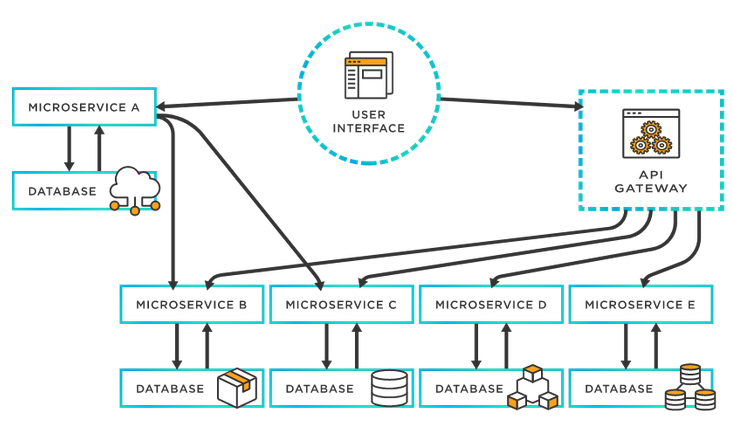
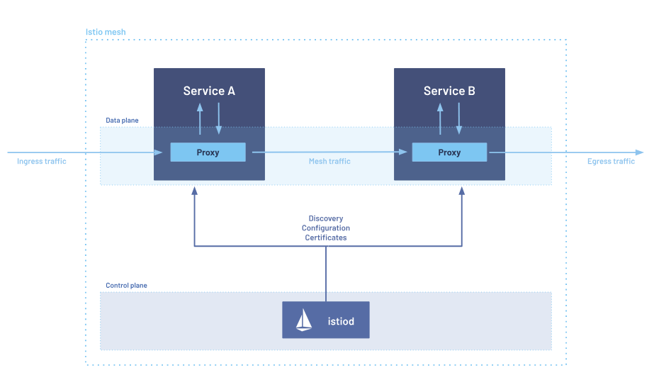
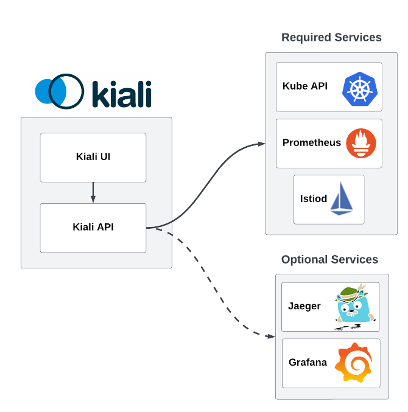
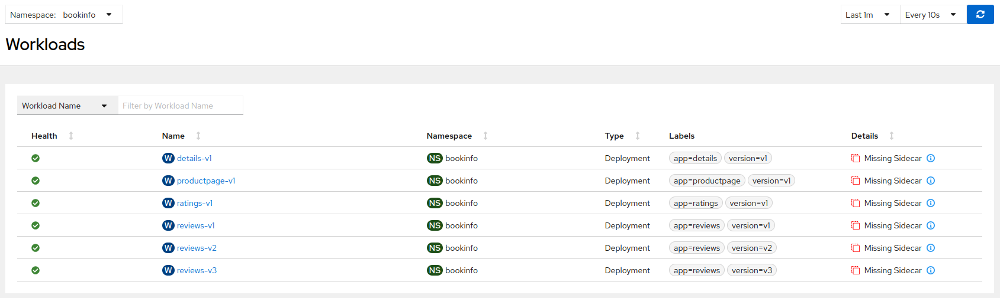
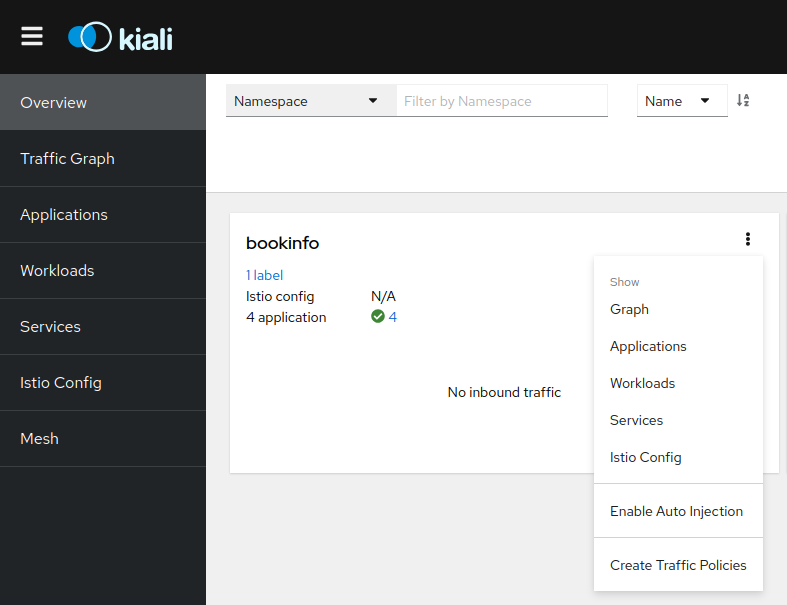
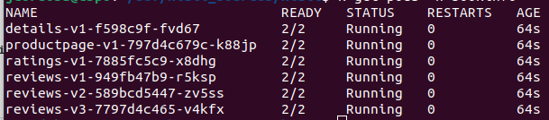
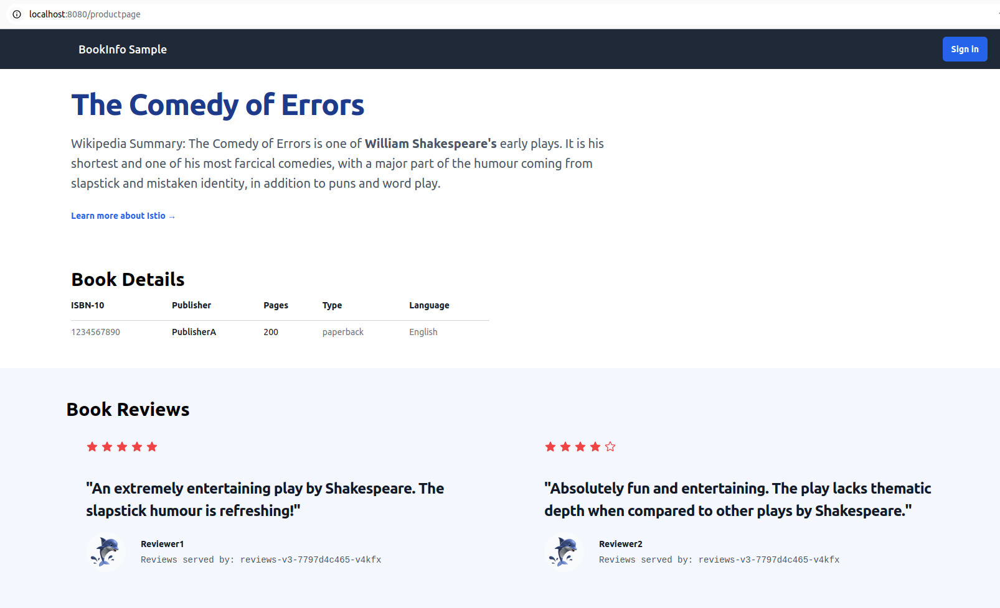

# Configurando tu Service Mesh con Istio y Kiali

## Tabla de Contenidos

--

# Introduccion

En este taller veremos como configurar una red de servicios en nuestra arquitectura de microservicios con Istio Service Mesh, de código abierto, y configurar Kiali como interfaz Gráfica.
Veremos los beneficios que aporta a nivel de seguridad y observabilidad.

## Porqué un service Mesh

En el desarrollo tradicionales, encontramos grandes aplicaciones monoliticas donde teníamos un mismo programa que se ejecutaba la misma plataforma. Como podemos pensar en aplicaciones java web empaquetadas en un archivo .war.

En las aplicaciones de microservicios, se divide esta gran aplicacion en diferentes microservicios, donde se encargan cada uno de una funcion y se ejecutan en sus propios procesos.

Con esto, se consiguen varios beneficios:

* Escalabilidad
* Integración de diferentes servicios
* Paralelización del desarrollo

Pero tambien, surgen nuevos problemas relacionados con esta arquitectura:

* Se pierden las dependencias de qué servicio se comunica con cual
* Se pierde el control de la aplicación

Existen aplicaciones de más de 50 microservicios donde estos problemas cobran especial relevancia.

Aquí es donde nos beneficia tener un Service Mesh - O malla de servicios.
Un service mesh es una capa de infraestructura que podemos agregar a nuestras aplicaciones de microservicios, que nos permite controlar la comunicación entre servicios. Ademas, nos proporciona otros beneficios relacionados con la infraestructura (Como encriptación de las comunicaciones), para que el desarrollador se preocupe solo de la funcionalidad de la aplicación.

Entre estos beneficios están:

* Observabilidad: Nos proporciona datos de las comunicaciones a través de métricas, trazas distribuidas o logs de acceso.
* Gestión de tráfico: A través de reglas de enrutado podemos controlar el flujo de tráfico aplicado en diferentes capas.
* Seguridad: Aporta encriptación de las comunicaciones con TLS y nos permite introducir políticas y auditoría de acceso.



## Que es Istio

Istio es una Service Mesh de código abierto que se superpone de forma transparente a las aplicaciones distribuidas. Podemos añadirlo de forma transparente a nuestra arquitectura de microservicios para incluir todos los beneficios de un Service Mesh.

En la siguiente imagen podemos ver la arquitectura de Istio:



* Data plane.
* Control plane.

Istio funciona con sidecars, un proxy que se despliega en cada contenedor de nuestros workloads que hayamos incluido en la Mesh. Un proxy Envoy, que funciona a nivel de capa 7 en el data plane y aplica todas las politicas que hayamos configuration.

Existe otro modo de funcionamiento de Istio llamado Ambient, en fase beta, que se comentará más adelante.

## Que es Kiali

Kiali es una interfaz gráfica para Istio, que interpreta los datos producidos por Istio y los muestra a través de gráficos de tráfico, gráficos de la Mesh y diagramas. Nos permite visualizar fácilmente todos los datos disponibles para nuestras aplicaciones, trazas, logs, y tambien nos ayuda a encontrar problemas en la Mesh.

Además, a través de Kiali podremos crear con wizards de forma sencilla diferentes configuraciones de Istio.

En la siguiente imagen se puede ver la arquitectura de Kiali, con los servicios necesarios y opcionales:




# Instalación paso a paso
## Prerrequisitos

En este tutorial emplearemos Minikube, una herramienta de código abierto que permite crear y administrar clústeres de Kubernetes en un entorno local.

Para ello se necesitarán privilegios de administrador.

Que necesitamos descargar:

- Descargamos la herramienta de la linea de comandos de kubernetes [kubectl](https://kubernetes.io/docs/tasks/tools/#kubectl)
- Descargamos la última version de [minikube](https://kubernetes.io/docs/tasks/tools/#minikube)
- Descargamos un [hipervisor](https://minikube.sigs.k8s.io/docs/start/?arch=%2Flinux%2Fx86-64%2Fstable%2Fbinary+download#install-a-hypervisor) para minikube. Se puede usar Docker, podman, VistualBox...

Si no estamos usando el driver por defecto de minikube, lo podemos configurar así:

`minikube config set driver kvm2`

Arrancamos minikube con este comando:

`minikube start`

Si los recursos por defecto no fueran suficientes, podemos arrancarlo con el siguiente comando:

`minikube start --memory=16384 --cpus=4`

## Instando Istio

En esta sección, veremos cómo instalar istio en modo Sidecar.
Istio se puede instalar de varias formas, en este caso utilizaremos la herramienta de linea de comandos istioctl.

- Descargamos [istio](https://istio.io/latest/docs/setup/additional-setup/download-istio-release/)

`curl -L https://istio.io/downloadIstio | ISTIO_VERSION=1.23.2 TARGET_ARCH=x86_64 sh -`
- Vamos a la carpeta descargada:

`cd istio-1.23.2`
- Añadimos el cliente al path (Linux):

`export PATH=$PWD/bin:$PATH`
- Creamos el nampesace para istio:

`kubectl create ns istio-system`
- Instalamos istio con el perfil por defecto:

`istioctl install`

Si necesitamos pasar algun valor de configuración, lo podemos hacer con --set:

`istioctl install --set meshConfig.accessLogFile=/dev/stdout`

Otra forma de configuración sería:

```
cat <<EOF > ./my-config.yaml
apiVersion: install.istio.io/v1alpha1
kind: IstioOperator
spec:
  meshConfig:
    accessLogFile: /dev/stdout
EOF
```

`istioctl install -f my-config.yaml`

It is possible to list all the different profiles:

`istioctl profile list`

Instalaremos tambien los CRDs del Gateway API, que no estan instalados por defecto:

`get crd gateways.gateway.networking.k8s.io &> /dev/null || { kubectl kustomize "github.com/kubernetes-sigs/gateway-api/config/crd?ref=v1.1.0" | kubectl apply -f -; }`

## Instando addons
Kiali requiere Prometheus para funcionar correctamente, por lo que lo instalaremos de la siguiente forma:

`kubectl apply -f ${ISTIO_HOME}/samples/addons/prometheus.yaml`

Grafana y Jaeger son opcionales, pero tambien los instalaremos para ver toda la funcionalidad disponible en Kiali:

`kubectl apply -f ${ISTIO_HOME}/samples/addons/grafana.yaml`

`kubectl apply -f ${ISTIO_HOME}/samples/addons/jaeger.yaml`

## Instalando Kiali
La forma más sencilla de instalar Kiali es applicando el yaml de configuration que viene como un addon de Istio:


Vamos a hacer algunos cambios en la configuración de Kiali. Vamos a abrir el yaml y cambiar lo siguiente (Haciendo antes una copia de seguridad):

```
    external_services:
      custom_dashboards:
        enabled: true
      istio:
        root_namespace: istio-system
      tracing:
        enabled: true
```

Aplicamos el yaml:

`kubectl apply -f ${ISTIO_HOME}/samples/addons/kiali.yaml`

Esta no es la forma recomendada para instalar en entornos de producción, pero si para testing o como una forma rápida de instalar y probar.

## Comprobando que todo esté instalado
Vamos a comprobar que tengamos todo instalado.
Vamos a listar los despliegues, pods y servicios que tenemos en el namespace de istio (istio-system):

`kubectl get all -n istio-system`

Así podemos comprobar que todos los pods están arrancados:


Ahora vamos a hacer un port-forward del servicio de Kiali para acceder:

`kubectl port-forward svc/kiali 20001:20001 -n istio-system`

Y accedemos al navegador:

http://localhost:20001/


## Instalando una aplicación de demo: Bookinfo
La demo de bookinfo es una aplicación compuesta por 4 microservicios para demostrar diferentes funconalidades de Istio.
La aplicación visualiza información de un libro, algo parecido a una entrada en el catálogo de una tienda de libros online.
En la página, se visualiza la descripción del libro, los detalles (Como el ISBN, el número de páginas), y algunas opiniones.

Consta de los siguientes microservicios:

* productpage: Llama a los servicios de details y reviews para mostrar la información en su página.
* details: Contiene información del libro.
* reviews: Contiene las opiniones del libro. Llama a ratings.
* ratings: Las puntuaciones del libro, que acompañan a cada opinión.

Hay 3 versiones del servicio de reviews:
* v1: No llama a ratings.
* v2: Llama a ratings, y visualiza cada puntuación con estrellas negras del 1 al 5.
* v3: Llama a ratings, y visualiza cada puntuación con estrellas rojas del 1 al 5.

Vamos a desplegar la aplicación de bookinfo. Primero crearemos un namespace:

`kubectl create ns bookinfo`

Una vez creado, vamos a desplegar la aplicación en este espacio de nombres:

`kubectl apply -f https://raw.githubusercontent.com/istio/istio/release-1.23/samples/bookinfo/platform/kube/bookinfo.yaml -n bookinfo`

Vamos a probar que funciona enviando tráfico:

`kubectl exec "$(kubectl get pod -l app=ratings -n bookinfo -o jsonpath='{.items[0].metadata.name}')" -c ratings -n bookinfo -- curl -sS productpage:9080/productpage | grep -o "<title>.*</title>"`

Vamos que aparece el nuevo namespace en Kiali, podemos ver sus workloads, pero no hay ningún gráfico de tráfico, y vemos que Kiali nos está diciendo que a los workloads les faltan los sidecars:



Esto es, porque no hemos añadido nuestra aplicación en la mesh.
Lo podemos hacer desde Kiali, de forma tan sencilla como pulsando en el botón "Enable Auto Injection" desde la tarjeta del namespace:



Esto es equivalente a añadir el label de injection de Istio en el namespace:

`kubectl label namespace bookinfo istio-injection=enabled`

Para que tenga efecto, en necesario reiniciar los pods:

`kubectl rollout restart deployment -n bookinfo`

Podemos ver en Kiali que ya no se muestra el mensaje de missing sidecars.

Tambien, desde línea de comandos, si listamos los pods de bookinfo, ahora hay dos contenedores por cada pod:

`kubectl get pods -n bookinfo`



Volvamos a enviar tráfico:
`kubectl exec "$(kubectl get pod -l app=ratings -n bookinfo -o jsonpath='{.items[0].metadata.name}')" -c ratings -n bookinfo -- curl -sS productpage:9080/productpage | grep -o "<title>.*</title>"`

Con varias peticiones, vemos el Gráfico del Tráfico algo similar a esto:


Al añadir nuestra aplicación en la mesh, Istio genera métricas en prometheus. Kiali puede interpretar estos datos y en base a estas métricas, nos muestra este gráfico.
Aquí podemos ver de forma sencilla que microservicios componen nuestra aplicación, así como el flujo de comunicación. 

Podemos seleccionar distintos datos a mostrar. 

El color de la flecha, nos muestra cual es el protocolo de la comunicación, y tambien el estado. Cuando vemos una fecha verde, nos indica que ha sido una petición HTTP y con código 200 (OK). 

### Abrir la aplicación al tráfico exterior

Vamos a hacer la aplicación accesible desde fuera de la Mesh. Para ello, crearemos un ingress gateway, que se encarga de mapear un path a una ruta desde la entrada de la Mesh. 

`kubectl apply -f samples/bookinfo/gateway-api/bookinfo-gateway.yaml -n bookinfo`

Vamos a cambiar el valor por defecto del tipo de Gateway, el cual se crea como un LoadBalancer, a ClusterIP: 

`kubectl annotate gateway bookinfo-gateway networking.istio.io/service-type=ClusterIP --namespace=bookinfo`

Y podemos ver el estado del gateway: 

`kubectl get gateway -n bookinfo`

Ahora podemos conectarnos al servicio de productpage a través de este gateway: 

`kubectl port-forward svc/bookinfo-gateway-istio -n bookinfo 8080:80`

Accediendo desde el navegador: 

`http://localhost:8080/productpage`




## Aplicando configuraciones
...

# Istio y Ambient
...

