# Configurando tu Service Mesh con Istio y Kiali

## Tabla de Contenidos

1. [Introduccion](#introduccion) 
   - [Porqué un service mesh](#porqué-un-service-mesh)
   - [Qué es Istio?](#que-es-istio)
   - [Qué es Kiali?](que-es-kiali)
2. [Instalación paso a paso](#instalación-paso-a-paso)
   - [Prerrequisitos](#prerrequisitos)
   - [Instalando Istio](#instando-istio)
   - [Instalando Addons](#instando-addons)
   - [Instalando Kiali](#instalando-kiali)
   - [Comprobando que todo esté instalado](#comprobando-que-todo-esté-instalado)
   - [Instalando una aplicación de ejemplo: Bookinfo](#instalando-una-aplicación-de-demo-bookinfo)
   - [Abrir la aplicación al tráfico exterior](#abrir-la-aplicación-al-tráfico-exterior)
3. [Aplicando configuraciones](#aplicando-configuraciones)
4. [Istio Ambient](#aplicando-configuraciones)
   - [Qué es Istio Ambient](#que-es-istio-ambient)
   - [Instalando Istio Ambient](#instalando-istio-ambient)
   - [Añadiendo Bookinfo a Ambient Mesh](#añadiendo-bookinfo-a-ambient-mesh)
   - [Añadiendo un Waypoint proxy](#añadiendo-un-waypoint-proxy)
5. [Desinstalando Istio Ambient](#desinstalando-istio)

# Introduccion

En este taller veremos como configurar una red de servicios en nuestra arquitectura de microservicios con Istio Service Mesh, de código abierto, y configurar Kiali como interfaz Gráfica.
Veremos los beneficios que aporta a nivel de seguridad y observabilidad.

## Porqué un service Mesh

En el desarrollo tradicionales, encontramos grandes aplicaciones monoliticas donde teníamos un mismo programa que se ejecutaba la misma plataforma. Como podemos pensar en aplicaciones java web empaquetadas en un archivo .war.

En las aplicaciones de microservicios, se divide esta gran aplicacion en diferentes microservicios, donde se encargan cada uno de una funcion y se ejecutan en sus propios procesos.

Con esto, se consiguen varios beneficios:

* Escalabilidad
* Integración de diferentes servicios
* Paralelización del desarrollo

Pero tambien, surgen nuevos problemas relacionados con esta arquitectura:

* Se pierden las dependencias de qué servicio se comunica con cual
* Se pierde el control de la aplicación

Existen aplicaciones de más de 50 microservicios donde estos problemas cobran especial relevancia.

Aquí es donde nos beneficia tener un Service Mesh - O malla de servicios.
Un service mesh es una capa de infraestructura que podemos agregar a nuestras aplicaciones de microservicios, que nos permite controlar la comunicación entre servicios. Ademas, nos proporciona otros beneficios relacionados con la infraestructura (Como encriptación de las comunicaciones), para que el desarrollador se preocupe solo de la funcionalidad de la aplicación.

Entre estos beneficios están:

* Observabilidad: Nos proporciona datos de las comunicaciones a través de métricas, trazas distribuidas o logs de acceso.
* Gestión de tráfico: A través de reglas de enrutado podemos controlar el flujo de tráfico aplicado en diferentes capas.
* Seguridad: Aporta encriptación de las comunicaciones con TLS y nos permite introducir políticas y auditoría de acceso.


## Que es Istio

Istio es una Service Mesh de código abierto que se superpone de forma transparente a las aplicaciones distribuidas. Podemos añadirlo de forma transparente a nuestra arquitectura de microservicios para incluir todos los beneficios de un Service Mesh.

En la siguiente imagen podemos ver la arquitectura de Istio:


* Data plane.
* Control plane.

Istio funciona con sidecars, un proxy que se despliega en cada contenedor de nuestros workloads que hayamos incluido en la Mesh. Un proxy Envoy, que funciona a nivel de capa 7 en el data plane y aplica todas las politicas que hayamos configuration.

Existe otro modo de funcionamiento de Istio llamado Ambient, en fase beta, que se comentará más adelante.

## Que es Kiali

Kiali es una interfaz gráfica para Istio, que interpreta los datos producidos por Istio y los muestra a través de gráficos de tráfico, gráficos de la Mesh y diagramas. Nos permite visualizar fácilmente todos los datos disponibles para nuestras aplicaciones, trazas, logs, y tambien nos ayuda a encontrar problemas en la Mesh.

Además, a través de Kiali podremos crear con wizards de forma sencilla diferentes configuraciones de Istio.

En la siguiente imagen se puede ver la arquitectura de Kiali, con los servicios necesarios y opcionales:

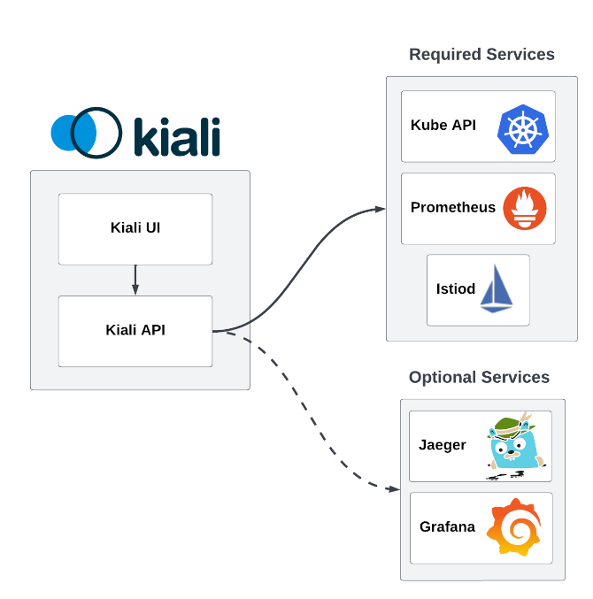


# Instalación paso a paso
## Prerrequisitos

En este tutorial emplearemos Minikube, una herramienta de código abierto que permite crear y administrar clústeres de Kubernetes en un entorno local.

Para ello se necesitarán privilegios de administrador.

Que necesitamos descargar:

- Descargamos la herramienta de la linea de comandos de kubernetes [kubectl](https://kubernetes.io/docs/tasks/tools/#kubectl)
- Descargamos la última version de [minikube](https://kubernetes.io/docs/tasks/tools/#minikube)
- Descargamos un [hipervisor](https://minikube.sigs.k8s.io/docs/start/?arch=%2Flinux%2Fx86-64%2Fstable%2Fbinary+download#install-a-hypervisor) para minikube. Se puede usar VirtualBox, pero tambien nos sirve una herramienta gestora de contenedores como Docker o Podman.

Si no queremos utilizar el driver por defecto de minikube, lo podemos configurar así:
```bash
minikube config set driver kvm2
```

Arrancamos minikube con este comando:
```bash
minikube start
```
Si los recursos por defecto no fueran suficientes, podemos arrancarlo con el siguiente comando:

```bash
minikube start --memory=16384 --cpus=4
```

## Instando Istio

En esta sección, veremos cómo instalar istio en modo Sidecar.
Istio se puede instalar de varias formas, en este caso utilizaremos la herramienta de linea de comandos istioctl.

- Descargamos [istio](https://istio.io/latest/docs/setup/additional-setup/download-istio-release/)
```bash
curl -L https://istio.io/downloadIstio | ISTIO_VERSION=1.23.2 TARGET_ARCH=x86_64 sh -
```
- Vamos a la carpeta descargada:
```bash
cd istio-1.23.2
export ISTIO_HOME=$(pwd)
```
- Añadimos el cliente al path (Linux):
```bash
export PATH=$PWD/bin:$PATH
```
- Creamos el namespace para istio:
```bash
kubectl create ns istio-system
```
- Para instalar Istio utilizaremos "istioctl install". Los valores de configuración para la instalación se pasan con --set. Para este taller utilizaremos lo siguientes:

```bash
istioctl install --set values.meshConfig.enableTracing=true --set values.meshConfig.defaultConfig.tracing.zipkin.address=zipkin.istio-system:9411 --set values.meshConfig.defaultConfig.tracing.sampling=100.0
```

 y verificamos que esta todo correctamente:

 ```bash
istio-1.23.2$ kubectl get pods -n istio-system
NAME                                    READY   STATUS    RESTARTS   AGE
istio-ingressgateway-64f9774bdc-wp54t   1/1     Running   0          1m
istiod-868cc8b7d7-n2gg4                 1/1     Running   0          2m

```

Otra forma de configuración sería:

```
cat <<EOF > ./my-config.yaml
apiVersion: install.istio.io/v1alpha1
kind: IstioOperator
spec:
  meshConfig:
    accessLogFile: /dev/stdout
EOF
```
```bash
istioctl install -f my-config.yaml
```

Es posible listar todos los perfiles con el siguiente comando:
```bash
istioctl profile list
```

Instalaremos tambien los CRDs del Gateway API, que no estan instalados por defecto:
```bash
get crd gateways.gateway.networking.k8s.io &> /dev/null || { kubectl kustomize "github.com/kubernetes-sigs/gateway-api/config/crd?ref=v1.1.0" | kubectl apply -f -; }
```

## Instando addons

Kiali requiere Prometheus para funcionar correctamente, por lo que lo instalaremos de la siguiente forma:
```bash
kubectl apply -f ${ISTIO_HOME}/samples/addons/prometheus.yaml
```

Grafana y Jaeger son opcionales, pero tambien los instalaremos para ver toda la funcionalidad disponible en Kiali:
```bash
kubectl apply -f ${ISTIO_HOME}/samples/addons/grafana.yaml
```
```bash
kubectl apply -f ${ISTIO_HOME}/samples/addons/jaeger.yaml
```

Esperar a que todo este creado correctamente

```bash
/istio-1.23.2$ kubectl get pods -n istio-system
NAME                                    READY   STATUS              RESTARTS   AGE
grafana-7f76bc9cdb-tjnrc                0/1     ContainerCreating   0          14s
istio-ingressgateway-64f9774bdc-wp54t   1/1     Running             0          101m
istiod-868cc8b7d7-n2gg4                 1/1     Running             0          102m
jaeger-66f9675c7b-dshzt                 0/1     ContainerCreating   0          11s
prometheus-7979bfd58c-ml648             2/2     Running             0          102 
```

## Instalando Kiali
La forma más sencilla de instalar Kiali es applicando el yaml de configuration que viene como un addon de Istio:


Vamos a hacer algunos cambios en la configuración de Kiali. Vamos a abrir el yaml y cambiar lo siguiente (Haciendo antes una copia de seguridad):

```bash
cp $ISTIO_HOME/samples/addons/kiali.yaml $ISTIO_HOME/samples/addons/kiali.copy.yaml
vim $ISTIO_HOME/samples/addons/kiali.yaml
```

```yaml
    external_services:
      custom_dashboards:
        enabled: true
      istio:
        root_namespace: istio-system
      tracing:
        enabled: true
        external_url: "http://localhost:16686/jaeger"
```

Aplicamos el yaml:

```bash
kubectl apply -f ${ISTIO_HOME}/samples/addons/kiali.yaml
```

Esta no es la forma recomendada para instalar en entornos de producción, pero si para testing o como una forma rápida de instalar y probar.

## Comprobando que todo esté instalado
Vamos a comprobar que tengamos todo instalado.
Vamos a listar los despliegues, pods y servicios que tenemos en el namespace de istio (istio-system):

```bash
kubectl get all -n istio-system
```

Así podemos comprobar que todos los pods están arrancados:

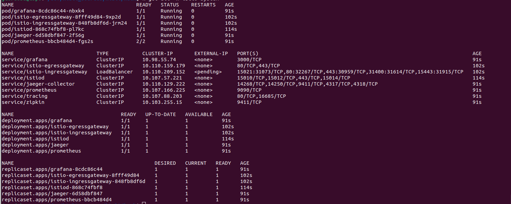

Ahora vamos a hacer un port-forward del servicio de Kiali para acceder:

```bash
istioctl dashboard kiali
```

Y accedemos al navegador:

[http://localhost:20001/](http://localhost:20001/)


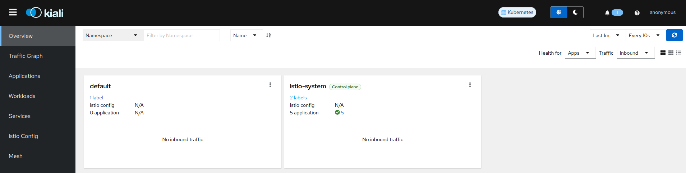

## Instalando una aplicación de demo: Bookinfo
La demo de bookinfo es una aplicación compuesta por 4 microservicios para demostrar diferentes funconalidades de Istio.
La aplicación visualiza información de un libro, algo parecido a una entrada en el catálogo de una tienda de libros online.
En la página, se visualiza la descripción del libro, los detalles (Como el ISBN, el número de páginas), y algunas opiniones.

Consta de los siguientes microservicios:

* productpage: Llama a los servicios de details y reviews para mostrar la información en su página.
* details: Contiene información del libro.
* reviews: Contiene las opiniones del libro. Llama a ratings.
* ratings: Las puntuaciones del libro, que acompañan a cada opinión.

Hay 3 versiones del servicio de reviews:
* v1: No llama a ratings.
* v2: Llama a ratings, y visualiza cada puntuación con estrellas negras del 1 al 5.
* v3: Llama a ratings, y visualiza cada puntuación con estrellas rojas del 1 al 5.

Vamos a desplegar la aplicación de bookinfo. Primero crearemos un namespace:

```bash
kubectl create ns bookinfo
```

Una vez creado, vamos a desplegar la aplicación en este espacio de nombres:

```bash
kubectl apply -f $ISTIO_HOME/samples/bookinfo/platform/kube/bookinfo.yaml -n bookinfo
```

Comprobar que tenemos todos los containers corriendo:

```bash
istio-1.23.2$ kubectl get pods -n bookinfo --watch
NAME                             READY   STATUS    RESTARTS   AGE
details-v1-65cfcf56f9-t97c4      1/1     Running   0          66s
productpage-v1-d5789fdfb-5cc8r   1/1     Running   0          65s
ratings-v1-7c9bd4b87f-zrjr2      1/1     Running   0          65s
reviews-v1-6584ddcf65-pk4mm      1/1     Running   0          65s
reviews-v2-6f85cb9b7c-zzdtt      1/1     Running   0          65s
reviews-v3-6f5b775685-mkg7k      1/1     Running   0          65s
```
Vamos a probar que funciona enviando tráfico:

```bash
kubectl exec "$(kubectl get pod -l app=ratings -n bookinfo -o jsonpath='{.items[0].metadata.name}')" -c ratings -n bookinfo -- curl -sS productpage:9080/productpage | grep -o "<title>.*</title>"
```

El resultado debería ser

`<title>Simple Bookstore App</title`

Vamos que aparece el nuevo namespace en Kiali, podemos ver sus workloads, pero no hay ningún gráfico de tráfico, y vemos que Kiali nos está diciendo que a los workloads les faltan los sidecars:


Esto es, porque no hemos añadido nuestra aplicación en la mesh.
Lo podemos hacer desde Kiali, de forma tan sencilla como pulsando en el botón "Enable Auto Injection" desde la tarjeta del namespace:


Esto es equivalente a añadir el label de injection de Istio en el namespace:

```bash
kubectl label namespace bookinfo istio-injection=enabled
```

Para que tenga efecto, en necesario reiniciar los pods:

```bash
kubectl rollout restart deployment -n bookinfo
```

Podemos ver en Kiali que ya no se muestra el mensaje de missing sidecars.

Tambien, desde línea de comandos, si listamos los pods de bookinfo, ahora hay dos contenedores por cada pod:

```bash
kubectl get pods -n bookinfo
```


Volvamos a enviar tráfico:

```bash
kubectl exec "$(kubectl get pod -l app=ratings -n bookinfo -o jsonpath='{.items[0].metadata.name}')" -c ratings -n bookinfo -- curl -sS productpage:9080/productpage | grep -o "<title>.*</title>"
```

Con varias peticiones, vemos el Gráfico del Tráfico algo similar a esto:

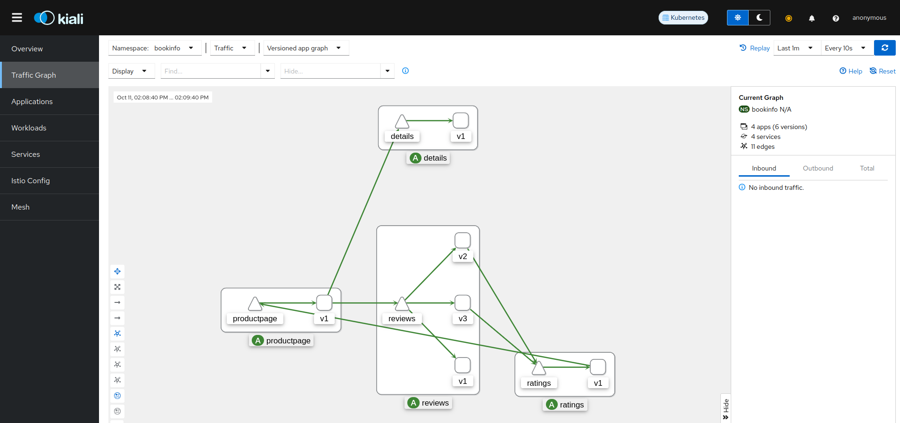

Al añadir nuestra aplicación en la mesh, Istio genera métricas en prometheus. Kiali puede interpretar estos datos y en base a estas métricas, nos muestra este gráfico.
Aquí podemos ver de forma sencilla que microservicios componen nuestra aplicación, así como el flujo de comunicación. 

Podemos seleccionar distintos datos a mostrar. 

El color de la flecha, nos muestra cual es el protocolo de la comunicación, y tambien el estado. Cuando vemos una fecha verde, nos indica que ha sido una petición HTTP y con código 200 (OK). 

### Abrir la aplicación al tráfico exterior

Vamos a hacer la aplicación accesible desde fuera de la Mesh. Para ello, crearemos un ingress gateway, que se encarga de mapear un path a una ruta desde la entrada de la Mesh. 

```bash
kubectl apply -f $ISTIO_HOME/samples/bookinfo/gateway-api/bookinfo-gateway.yaml -n bookinfo
```

Vamos a cambiar el valor por defecto del tipo de Gateway, el cual se crea como un LoadBalancer, a ClusterIP: 

```bash
kubectl annotate gateway bookinfo-gateway networking.istio.io/service-type=ClusterIP --namespace=bookinfo
```

Y podemos ver el estado del gateway: 

```bash
kubectl get gateway -n bookinfo
```

Ahora podemos conectarnos al servicio de productpage a través de este gateway: 

```bash
kubectl port-forward svc/bookinfo-gateway-istio -n bookinfo 8080:80
```

Accediendo desde el navegador: 

[http://localhost:8080/productpage](http://localhost:8080/productpage)


Vamos a mantener un generador de trafico en una terminal

```bash
while :; do curl -sS http://localhost:8080/productpage | grep -o "<title>.*</title>"; sleep 3; done > /dev/null

```

Abrimos Kiali para ver cómo se ve el gráfico ahora: 

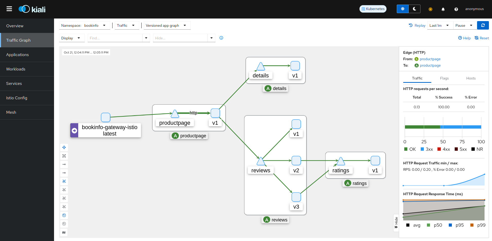

## Tracing

Abrimos la consola de jaeger

```bash
istioctl dashboard jaeger
```

Podremos ver todas las peticiones que estan entrando a nuestra aplicación
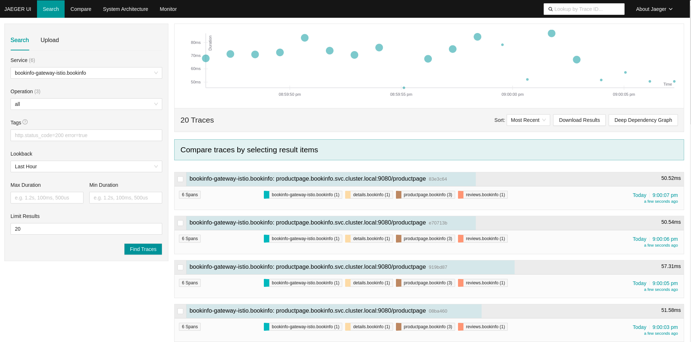

Y obtener información de cada una de ellas
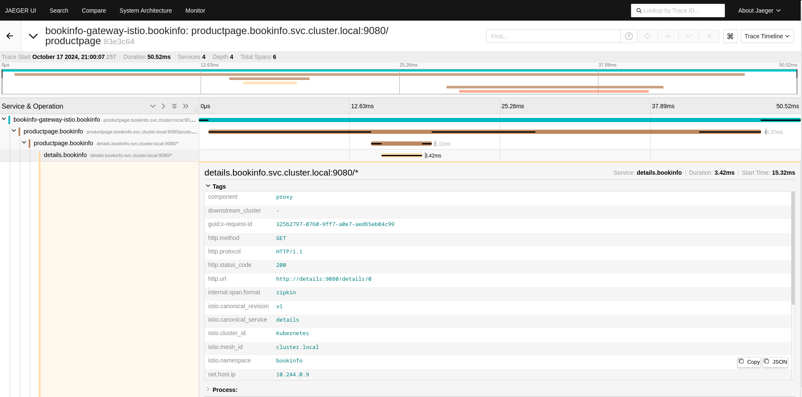


# Aplicando configuraciones

## Caso de uso con header `end-user`

Vamos a forzar al un usuario a que vaya a una version determinada. Aplicar este fichero [end-user-sample.yaml](https://raw.githubusercontent.com/kiali/community/refs/heads/main/events/2024_10_Setup_your_mesh_ES/config/end-user-sample.yaml )

```bash
kubectl apply -f https://raw.githubusercontent.com/kiali/community/refs/heads/main/events/2024_10_Setup_your_mesh_ES/config/end-user-sample.yaml -n bookinfo
```

¿Que ha pasado?

```yaml
apiVersion: networking.istio.io/v1alpha3
kind: VirtualService
metadata:
  name: reviews
spec:
  hosts:
    - reviews
  http:
  - match:
    - headers:
        end-user:
          exact: biznagafest
    route:
    - destination:
        host: reviews
        subset: v2
  - route:
    - destination:
        host: reviews
        subset: v1

```

Ahora el usuario de `biznagafest` solo puede acceder a la version v2 mientras que el resto va a la version 1.

¿Que muestra kiali si eliminamos el `DestinationRule` ?

Vamos a por otro ejemplo, vamos aplicar ahora [end-user-abort.yaml](https://raw.githubusercontent.com/kiali/community/refs/heads/main/events/2024_10_Setup_your_mesh_ES/config/end-user-abort.yaml )

```bash

kubectl apply -f https://raw.githubusercontent.com/kiali/community/refs/heads/main/events/2024_10_Setup_your_mesh_ES/config/end-user-abort.yaml -n bookinfo
```

¿Que ha pasado?

```yaml
apiVersion: networking.istio.io/v1alpha3
kind: VirtualService
metadata:
  name: ratings
spec:
  hosts:
  - ratings
  http:
  - match:
    - headers:
        end-user:
          exact: jason
    fault:
      abort:
        percentage:
          value: 100.0
        httpStatus: 500
    route:
    - destination:
        host: ratings
        subset: v1
  - route:
    - destination:
        host: ratings
        subset: v1
```

Vamos a resolverlo

Vamos a ver los wizards de Kiali y como lo hariamos.

Más ejemplos. Balanceado de carga de una versión a otra.

# Istio Ambient

## Que es Istio Ambient

Istio Ambient es una nueva arquitectura de Istio "sidecarless", donde se reemplaza el uso del sidecar por dos nuevos componentes, que operan en diferentes capas. Actualmente, esta en fase beta. 
Estos dos componentes se llaman ztunnel (L4) y Waypoint proxy (L7), que viene a ofrecer la misma funcionalidad que un sidecar, pero no se va a desplegar en el pod de la aplicación. 

La idea de Ambient es reducir el overhead de la infraestructura y mejorar el rendimiento. Cuando queremos las funcionalidades básicas de un Service Mesh (Como comunicaciones TLS, políticas de red en capa 4, o observabilidad en capa 4), ztunnel se va a encargar de procesamiento, mejorando el rendimiento. Normalmente, existe un componente por cada nodo del cluster, y el tráfico del pod se va a redirigir a través de ztunnel. 

Si además, necesitamos alguna funcionalidad de capa 7, incluiremos un Waypoint proxy. Actualmente, un Waypoint proxy es un Envoy proxy, el mismo componente empleado en un sidecar, pero que no se despliega uno por cada pod. La recomentación es crear uno por namespace. 

En la siguiente imagen podemos ver la arquitectura de Istio Ambient:

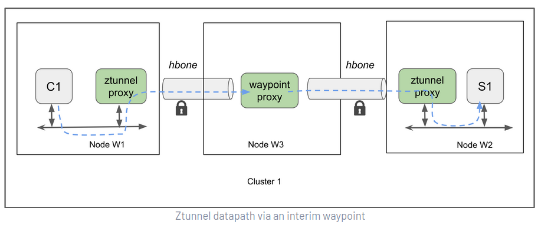

## Instalando Istio Ambient

Istio Ambient se instala con un perfil diferente. Es posible actualizar el perfil con el siguiente comando:

```bash
istioctl upgrade --set profile=ambient
```

Nos pedirá confirmación para que se instalen los nuevos componentes de Istio. 
Podemos ver que están en el namespace de Istio: 

```bash
kubectl get all -n istio-system
```

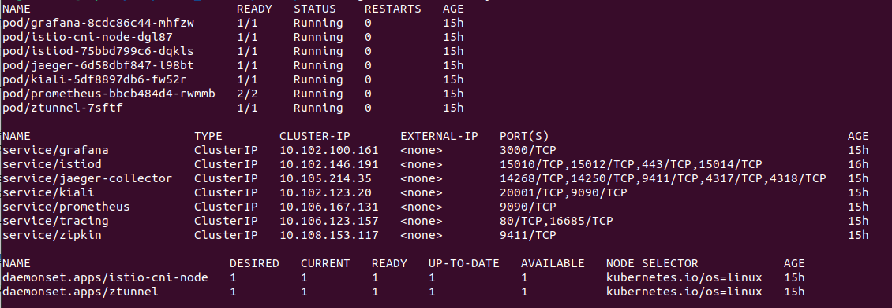

## Añadiendo bookinfo a Ambient Mesh

Las anotaciones para incluir un namespace en una Mesh con Ambient son diferentes a las de los sidecars. De esta forma, en una Mesh de Ambient pueden cohexistir namespaces con sidecars y con Ambient. 
Ahora vamos a eliminar las anotaciones de los sidecars para bookinfo: 

```bash
kubectl label ns bookinfo istio-injection-
```

Esto tambien se puede hacer desde Kiali: 


Y reiniciamos: 

```bash
kubectl rollout restart deployment -n bookinfo
```

Vemos que ahora los pods solo tienen un contenedor: 

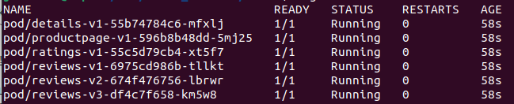

Y aparecen fuera de la Mesh: 

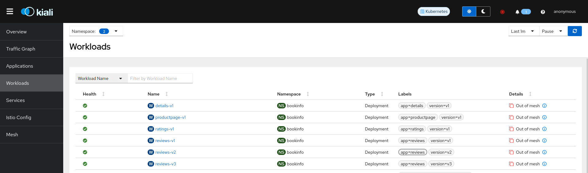

Vamos a añadirlos ahora a Ambient Mesh. Lo hacemos mediante anotaciones: 

```bash
kubectl label namespace bookinfo istio.io/dataplane-mode=ambient
```

Vamos a ver que nuestro namespace tiene un label indicando que está incluido en Ambient: 

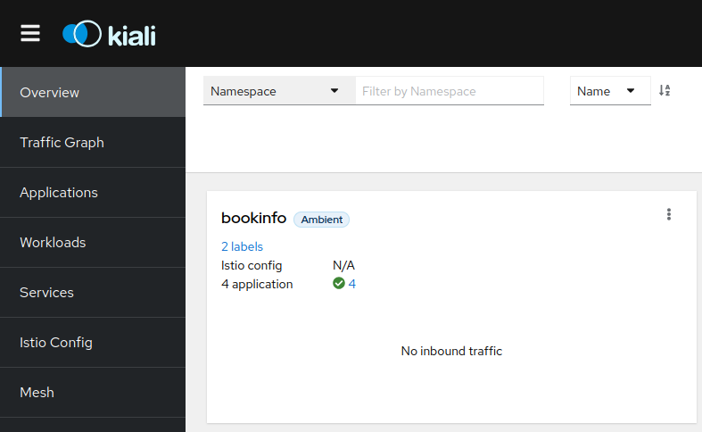

En la lista de workloads ya no no ve ningún mensaje indicando que están fuera de la Mesh. 
Si vamos al detalle de un workload, podemos ver el label de Ambient, y en el tooltip que aparece cuando hacemos hover, se muestra más información: 

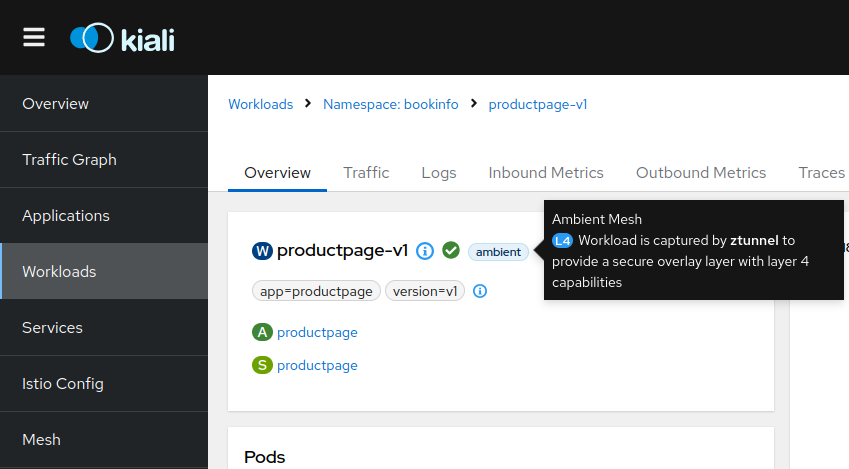

Vamos a enviar tráfico a través del gateway, a ver como se ve el gráfico de tráfico: 

```bash
kubectl exec "$(kubectl get pod -l app=ratings -n bookinfo -o jsonpath='{.items[0].metadata.name}')" -c ratings -n bookinfo -- curl -sS productpage:9080/productpage | grep -o "<title>.*</title>"
```

Vamos a Kiali y a "Traffic Graph". Podemos aumentar el tiempo por si no hemos hecho muchas peticiones. Y esto es lo que vemos: 

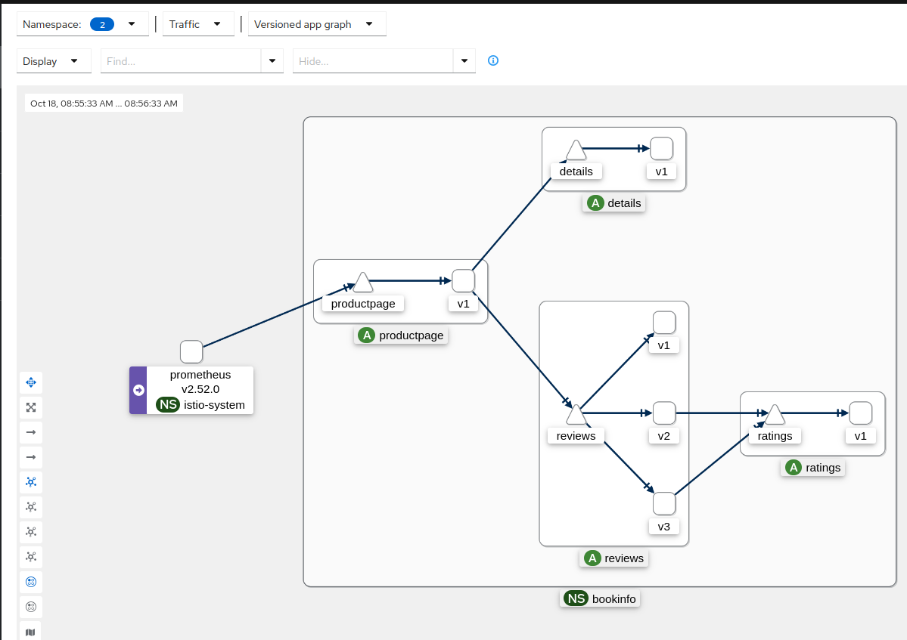

A diferencia de un gráfico con sidecars, vemos las flechas, que en este caso son azules en lugar de verdes. Esto significa que las conexion que se muestran son tráfico TCP. ¿Y esto porqué? Aunque en realidad son conextiones HTTP, el ztunnel sólo establece un análisis de capa 4, es por esto que no sabe identificar la información de capa 7. En futuras versiones (Kiali 2.0) se incluirá un selector de tráfico de Ambient para saber cual es el reporter desde donde se emitieron los datos de la telemetría y así tener en cuenta esta situación.

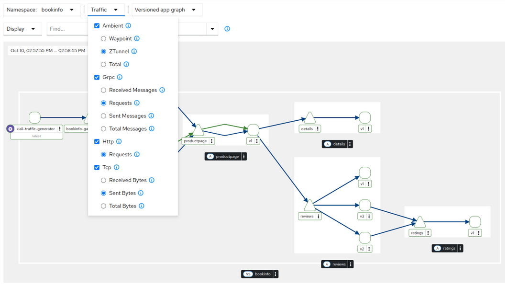

Como podemos ver, seleccionando en el menú Display "security", que el tráfico está encriptado: 

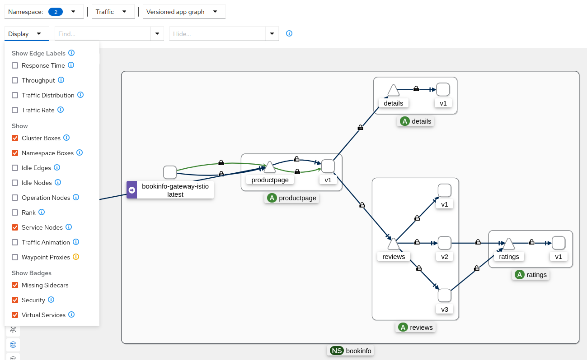


## Añadiendo un Waypoint proxy
Vamos a incluir un procesamiento de capa 7 adicional con un waypoint proxy. Crearemos uno para todo el namespace: 

```bash
istioctl waypoint apply -n bookinfo --enroll-namespace
```

Vemos que se ha creado un nuevo workload en Kiali, identificado como Waypoint proxy: 

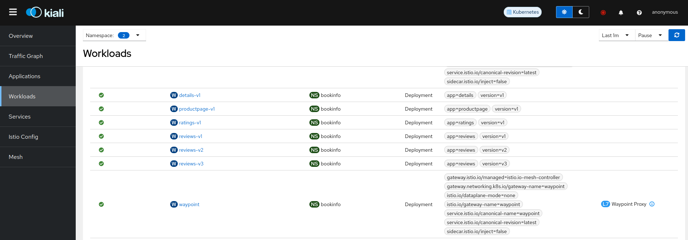

Si vamos al detalle de una de nuestras aplicaciones, podemos ver que se ha añadido el label L7 cuando se abre el tooltip de Ambient: 

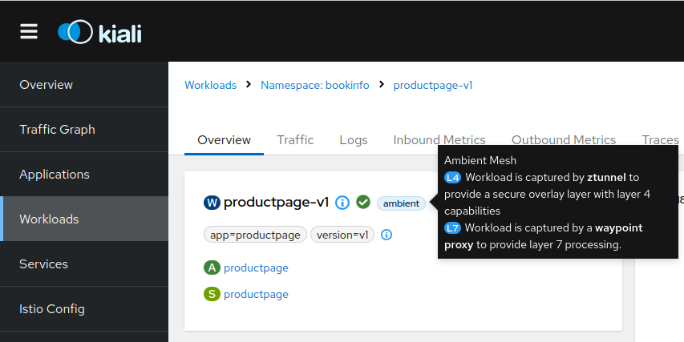

Vamos al gráfico y vemos que se ven conexiones http: 

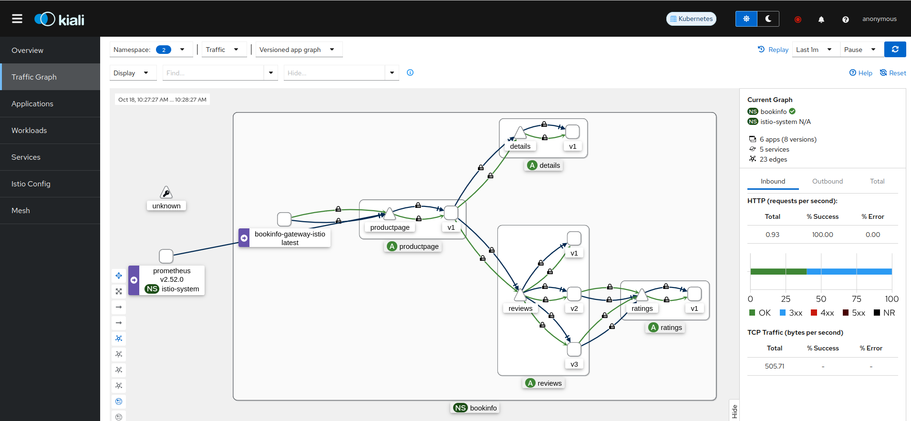

En esta versión todavía vemos dobles flechas, en la versión 2.0 de Kiali se incluyen mejoras respecto al gráfico de Ambient donde se ve una versión más simplificada. 

En el menú Display también podemos seleccionar la opción "waypoint proxy" para visualizar los nodos waypoint en el gráfico: 

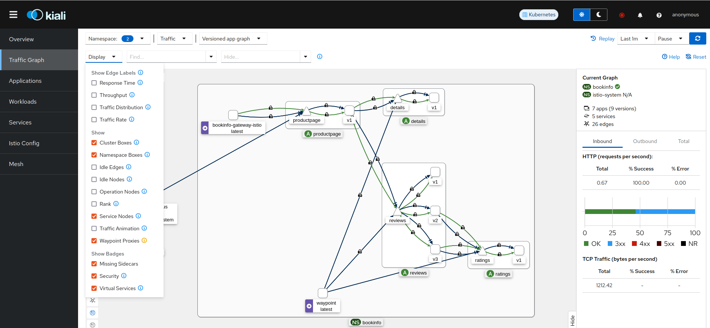

En esta versión, esta opción es todavía experimental, vemos que faltan algunas flechas (Todo el tráfico pasa por Ambient). Estas mejoras se incluyen en la versión 2.0 de Kiali. 
Esto se debe a que todavía no se realizó una adaptación de la telemetría de Ambient en el código actual, puesto que Waypoint reporta la telemetría de una forma un poco diferente a lo que lo hace Envoy. 

# Desinstalando Istio

Para desinstalar Istio hacemos lo siguiente: 

```bash
istioctl uninstall -y --purge
kubectl delete namespace istio-system
```
